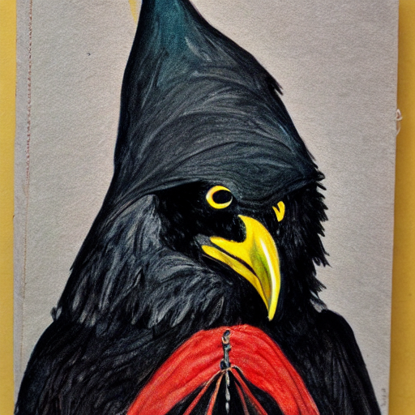

# Ken's User Page

[Skip to the bird section.](#bird-section)

**I am a fan of Python, but have dabbled in C/C++/Java/Ruby/Clojure.**

>Which is not, to say, that I'm any good at any of them. For example, would you like a cursed pomodoro?

```python
from time import sleep

while True: [eval(_) for _ in ["print('work!\a')", "sleep(25*60)", "print('rest!\a\a')", "sleep(5*60)"]]
```

I get my news from [the AP.](https://apnews.com/)

## Bird section



[Source image](bird_by_stablediffusion.png)

</br>

1. Ordered 
2. and 

</br>

- Unordered 
- Lists

</br>

- [x] Task 
- [ ] lists
